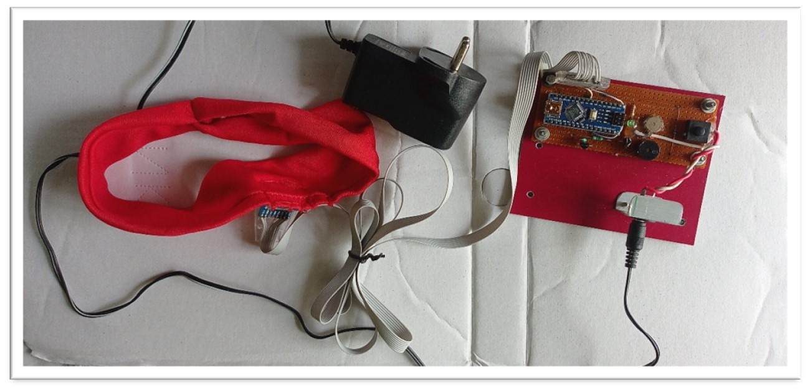
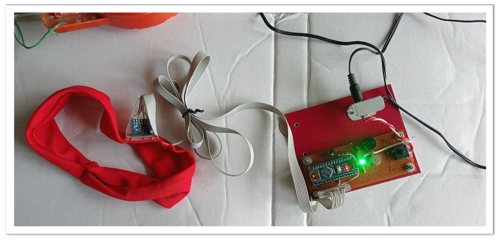
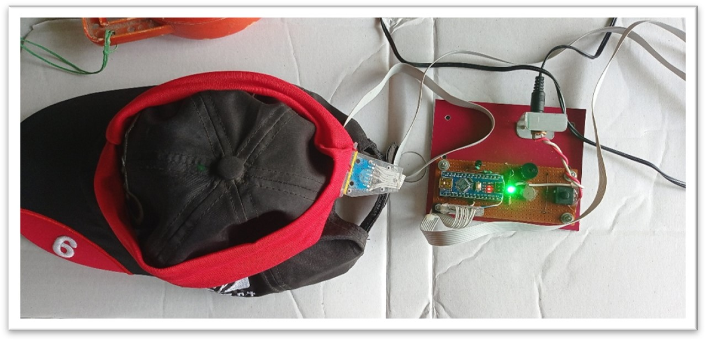

# Sleep Prevention Device
[![Apache License][license-shield]][license-url]
[![LinkedIn][linkedin-shield]][linkedin-url]

## Project Overview
The Sleep Prevention Device is designed to combat drowsiness among drivers, particularly those who travel long distances or drive late at night. The device uses a combination of an Arduino MPU6050 sensor and a buzzer to alert drivers when they show signs of sleepiness, thus preventing potential accidents.

## Team Information
- **Project Title**: Sleep Prevention Device

### Team Members
- **Baivab Sarkar** (baivabsarkar@gmail.com)
- **Tamal Putatunda** (tamalputatundu@gmail.com)
- **Oishee Mukhopadhyay** (oisheemukhopadhyay00@gmail.com)
- **Ananya Dutta** (ananyadutta.habra@gmail.com)
- **Abhishek Suman** (abhishek478suman@gmail.com)
- **Mentor**: Mr. Jit Chakraborty, Head Dept. of Chemistry

## Problem Statement
India has a high number of road accidents, many of which are caused by drowsy driving. Studies have shown that truck drivers often suffer from sleep deprivation, leading to increased risk on the roads.

## Project Abstract
This project addresses the issue of driver drowsiness by developing a device that detects and alerts drivers if they start to fall asleep. The device aims to provide a more efficient and less annoying solution compared to existing market options.

## Solution Overview
The Sleep Prevention Device operates by monitoring the driver's head movements. If the driver’s head tilts or nods for more than 3 seconds, the device triggers a buzzer to alert the driver. This system is built using the following components:
- **Arduino MPU6050**: Triple Axis Gyro Accelerometer Module
- **Buzzer**
- **Vibrator**
- **Power Supply and Switches**

## Novelty and Uniqueness
The device is unique in its application and design, providing an effective and low-cost solution for preventing drowsiness while driving. It can be worn on the head and emits an alarm when the driver’s head nods beyond a preset angle.

## Technical Details
### Circuit Diagram

## Components and Cost
| Item                            | Quantity | Cost (INR) | Purpose                  |
|---------------------------------|----------|------------|--------------------------|
| MPU6050 Accelerometer Module    | 1        | 649.00     | Movement detection       |
| Arduino Nano                    | 1        | 419.00     | Microcontroller          |
| SMPS 5V/1A                      | 1        | 150.00     | Power supply             |
| Vibrator                        | 1        | 129.00     | Alert mechanism          |
| ON/OFF Switch                   | 1        | 20.00      | Control switch           |
| Piezoelectric Buzzer            | 1        | 20.00      | Sound alert              |
| Power Connector                 | 1        | 30.00      | Power connection         |
| **Total**                       |          | **1417.00**|                          |

### Prototype Status
The prototype of the Sleep Prevention Device is complete and ready for potential deployment in vehicles.

## Social Impact
This device can significantly reduce the number of accidents caused by drowsy driving, thus saving lives and creating a safer driving environment. It is especially useful for long-distance travelers and night-time drivers.

## Future Scope
The proposed system offers a minimally intrusive approach to monitoring driver drowsiness with high accuracy and efficiency. Future developments may include:
- Enhanced real-time processing and detection capabilities.
- Broader applications beyond driving, such as for machine operators and security personnel.
- Potential government regulation to make the device mandatory in vehicles.

## Supporting Materials
### Video Demonstration
 - [Watch the video demonstration 1](https://drive.google.com/file/d/1FPvCD51V66I0NAf_4ZMmb6FXbxwxx3TY/view?usp=drive_link)

 - [Watch the video demonstration 2](https://drive.google.com/file/d/1BDuGcYIaW6arX4XeqBtHUAaP3eK76h3p/view?usp=drive_link)
### Images of the Developed Device

## Contact
For further information, please contact the project team at the provided email addresses.

---
**Presented at JISTech2K21 by Team Insomnians**

[license-shield]: https://img.shields.io/badge/License-Apache%202.0-red.svg
[license-url]: https://github.com/iam-baivab/News-Scraping-using-BeautyfulSoup-Selenium-with-Django/blob/main/LICENSE
[linkedin-shield]: https://img.shields.io/badge/-LinkedIn-black.svg?style=flat&logo=linkedin&colorB=blue
[linkedin-url]: https://www.linkedin.com/in/baivabsarkar/